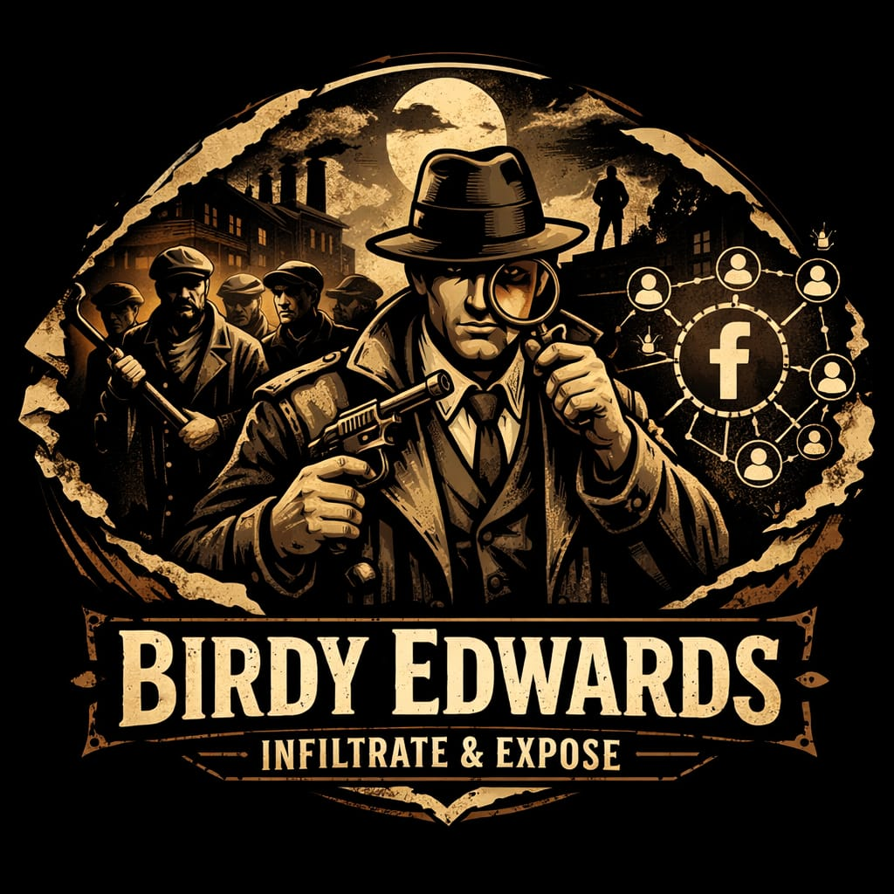
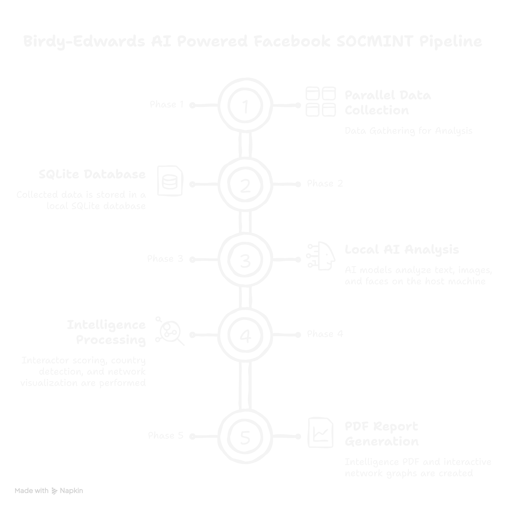

<div align="center">



# BIRDY-EDWARDS

### *Infiltrate & Expose*

[](https://python.org)
[](https://flask.palletsprojects.com)
[](https://ollama.com)
[](https://docker.com)
[]()
[]()

**AI-powered Facebook SOCMINT platform — 100% local, zero cloud dependency.**

[Installation](#installation) · [Troubleshooting](#troubleshooting) · [Disclaimer](#️-disclaimer) . [Contributing](#contributing)


</div>

---

## Architecture

<div align="center">

</div>

---

## Features

- 🔍 **Profile collection** — Automated data gathering of posts, photos, reels, and about data
- 🧠 **Interaction intelligence** — AI sentiment, stance, emotion, and language analysis per interaction
- 📊 **Actor scoring** — Weighted composite score with 5-tier classification system
- 🌍 **Country detection** — LLM identifies country of origin from profile signals
- 👤 **Face intelligence** — Face detection, 128D encoding, and identity clustering across all images. It uses HOG model.
- 🕸️ **Network graphs** — Interactive HTML graphs including force-directed and co-interactors relationship matrix
- 📄 **PDF reports** — Professional intelligence report with limited ammount of charts
- 🤖 **Local AI** — Ollama powered, gemma3:4b/12b/27b and other models(mention in web panel), runs on GPU or CPU
- 🐳 **Docker ready** — One command deployment on Linux and Windows

---

## ⚠️ Disclaimer

> BIRDY-EDWARDS is developed strictly for **authorized intelligence, law enforcement, and academic research purposes only**.
>
> This tool must only be used on Facebook profiles and content where you have explicit legal authorization to collect and analyze data. Use without authorization may violate Facebook's Terms of Service, applicable privacy laws (GDPR, IT Act, DPDP Act), and local regulations.
>
> The developer assumes **no liability** for misuse, unauthorized data collection, or any harm caused by improper use. All investigations are the sole responsibility of the operator.
>
> By using BIRDY-EDWARDS, you confirm your use is lawful, authorized, and compliant with all applicable laws in your jurisdiction.

---

## System Requirements

| Component | Minimum | Recommended |
|---|---|---|
| OS | Ubuntu 24.04 LTS / Windows 10+ | Ubuntu 24.04 LTS |
| RAM | 8 GB | 16 GB |
| Storage | 20 GB free | 40 GB free |
| Docker | Docker Desktop / Engine | Latest stable |
| Ollama | Latest | Latest |

---

## Installation

### Prerequisites

**Step 1 — Install Docker**

- **Linux:** https://docs.docker.com/engine/install/ubuntu/
- **Windows:** https://docs.docker.com/desktop/install/windows-install/

**Step 2 — Install Ollama**

- **Linux:**
```bash
curl -fsSL https://ollama.com/install.sh | sh
```
- **Windows:** Download installer from https://ollama.com/download

**Step 3 — Start Ollama bound to all interfaces**

- **Linux:**
```bash
OLLAMA_HOST=0.0.0.0:11434 ollama serve
```

To make this permanent:
```bash
sudo systemctl edit ollama
```
Add:
```ini
[Service]
Environment="OLLAMA_HOST=0.0.0.0:11434"
```
```bash
sudo systemctl daemon-reload && sudo systemctl restart ollama
```

- **Windows:** Ollama listens on all interfaces by default — no extra configuration needed.

---

### Quick Start

**Step 1 — Clone the repository**

```bash
git clone https://github.com/jeet-ganguly/birdy-edwards-1.0.git
cd birdy-edwards-1.0
```

**Step 2 — Create required files and directories**

- **Linux:**
```bash
mkdir -p app/reports app/face_data app/post_screenshots app/status
touch app/fb_cookies.pkl app/socmint.db app/socmint_manual.db app/.ollama_model
```

- **Windows (PowerShell):**
```powershell
New-Item -ItemType Directory app/reports, app/face_data, app/post_screenshots, app/status
New-Item -ItemType File app/fb_cookies.pkl, app/socmint.db, app/socmint_manual.db, app/.ollama_model
```

**Step 3 — Build the Docker image**

> ⚠️ First build takes **15–25 minutes** — dlib compiles from source. Subsequent builds are fast (layers cached).

```bash
docker compose build
```

**Step 4 — Start the container**

```bash
docker compose up -d

docker compose logs -f
```

**Step 5 — Open the web UI**

```
http://localhost:5000
```

---

### Pull an AI Model

Pull a model on your host machine:

```bash
ollama pull gemma3:4b
```

Or use the **AI Model panel** in the web UI — select a model and click **Apply & Pull**.

| RAM | Recommended Model |
|---|---|
| 8 GB | gemma3:4b |
| 16 GB | gemma3:12b |
| 32 GB | gemma3:27b |

---

### Import Session Cookies

BIRDY-EDWARDS requires a valid Facebook session. Use the **Cookie-Editor** browser extension — works on all platforms, no Selenium required.

> 🔒 **Operational Security:** It is strongly recommended to use a dedicated **sock puppet account** for investigations rather than your personal Facebook account. This protects your identity and prevents your primary account from being flagged or restricted.

1. Install Cookie-Editor → [Chrome](https://chrome.google.com/webstore/detail/cookie-editor/hlkenndednhfkekhgcdicdfddnkalmdm) · [Firefox](https://addons.mozilla.org/en-US/firefox/addon/cookie-editor/)
2. Log into your **dedicated investigation account** on Facebook
3. Click Cookie-Editor while on facebook.com
4. Click **Export → Export as JSON**
5. Go to `http://localhost:5000/tools/import-cookies` and paste

---

## Troubleshooting

**Ollama not reachable from Docker**
```bash
docker exec -it birdy-edwards curl http://host.docker.internal:11434/api/tags
```
If it fails, restart Ollama with `OLLAMA_HOST=0.0.0.0:11434 ollama serve`

**DB error: no such table or other DB related error**  
Start a new investigation — schema is created automatically on first use. If you stop process/program during analysis delete that investigation and then start new investigation. 

**Cookies expired**  
Go to `http://localhost:5000/tools/import-cookies` and re-import fresh cookies.

**Port 5000 already in use**  
Change in `docker-compose.yml`: `"5001:5000"` then access at `http://localhost:5001`

**Out of memory during build**  
Increase Docker Desktop memory to 8 GB+ via Settings → Resources → Memory

---

## Contributing

Contributions are welcome. Please follow these guidelines to keep the project clean and consistent.

**Reporting bugs**
- Open an Issue describing the bug, steps to reproduce, and your environment (OS, RAM, Docker version)
- Attach relevant logs from `docker compose logs`

**Feature requests**
- Open an Issue with a clear description of the feature and its use case
- Discuss before opening a Pull Request for large changes

**Submitting a Pull Request**
- Fork the repository
- Create a feature branch: `git checkout -b feature/your-feature-name`
- Commit your changes: `git commit -m "Add: short description"`
- Push to your branch: `git push origin feature/your-feature-name`
- Open a Pull Request against `main`

**Code guidelines**
- Follow existing code style — Python 3.12, Flask conventions
- Test your changes locally via Docker before submitting
- Do not commit `fb_cookies.pkl`, databases, or any scraped data
- Keep scraper changes minimal — Facebook DOM changes frequently

**What we welcome**
- Bug fixes and stability improvements
- New Ollama model support
- UI improvements
- Documentation improvements
- Additional language support for OCR and comment analysis

**What we do not accept**
- Features that bypass platform security controls
- Changes that introduce cloud dependencies
- Code that stores or transmits investigation data externally

---

## Acknowledgements

- Inspired by [Sherlock](https://github.com/sherlock-project/sherlock)
- Inspired by the OSINT and threat intelligence research community
- [SeleniumBase](https://github.com/seleniumbase/SeleniumBase) — Undetected Chrome automation
- [Ollama](https://ollama.com) — Local LLM inference engine
- [face_recognition](https://github.com/ageitgey/face_recognition) — Face detection and encoding library
- [pyvis](https://github.com/WestHealth/pyvis) — Interactive network graph visualization
- [reportlab](https://www.reportlab.com) — PDF generation
- [pytesseract](https://github.com/madmaze/pytesseract) — OCR engine wrapper

---

<div align="center">

**BIRDY-EDWARDS** · Infiltrate & Expose ·

</div>
