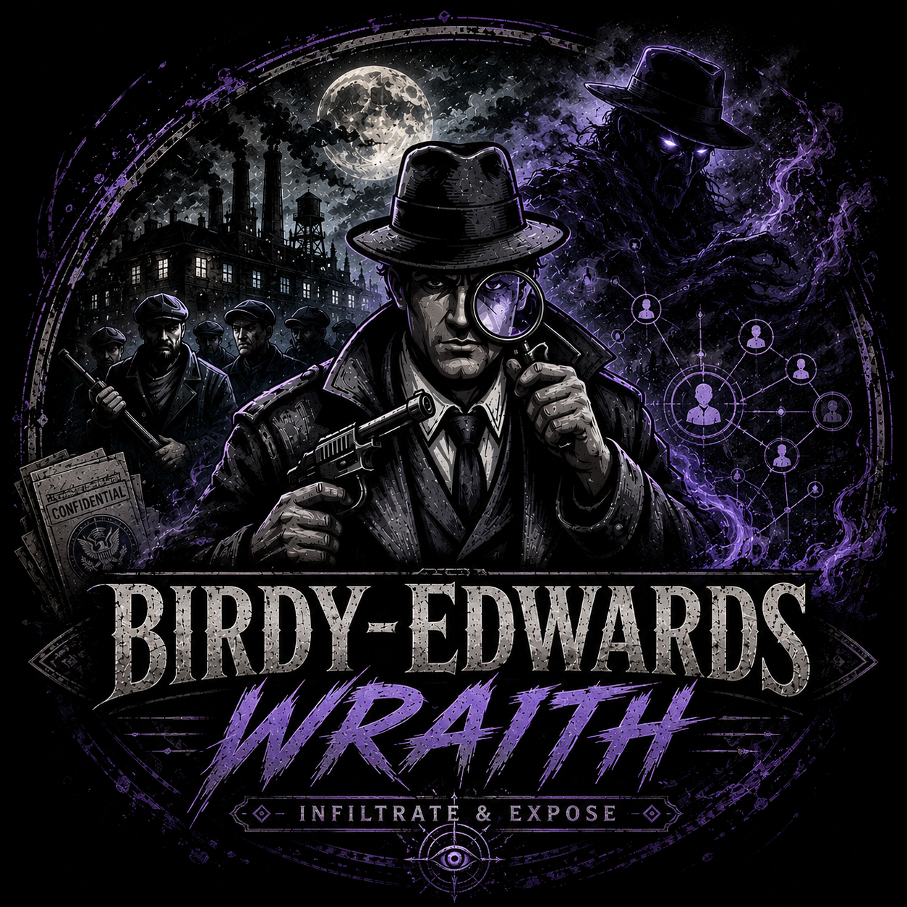
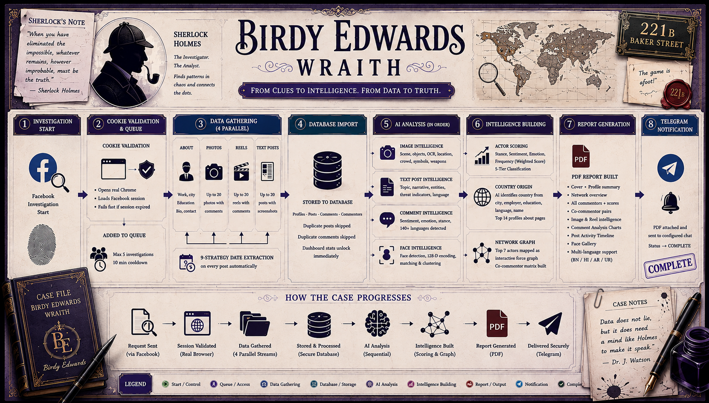

# BIRDY-EDWARDS 2.0

Infiltrate & Expose
> Automated AI powered Facebook intelligence tool for target profiling, network analysis and threat reporting. Runs entirely on-device via Ollama. AI-powered Facebook SOCMINT platform — 100% local, zero cloud dependency. For lite version check this repo [click here](https://github.com/jeet-ganguly/birdy-edwards-lite)

<div align="center">



[](https://python.org)
[](https://flask.palletsprojects.com)
[](https://ollama.com)
[](https://docker.com)
[]()
[]()
[]()

[Installation](#installation) · [Troubleshooting](#troubleshooting) · [Disclaimer](#️-disclaimer) · [Contributing](#contributing)


</div>

---

## Documentation

Full usage guides for both investigation modes are available on the project website:

- [Click Here](https://jeet-ganguly.github.io/profile/edwards.html)

[](https://jeet-ganguly.github.io/profile/edwards.html)

---

## How it works

<div align="center">

</div>

---

## What's new in v2.0

- 🗽 **Flexibility** - Now you can stop investigation in any phase and generate report pdf
- 🎬 **Reel intelligence** — AI extracts context summary, topic, named entities, and hashtags from every reel caption
- 🔗 **Co-commentor coordination matrix** — Heatmap of who comments alongside whom. Click any cell to see shared posts
- 👤 **HOG + CNN hybrid face detection** — Auto model selection by image size with CNN→HOG fallback. Face detection now runs on text post screenshots too
- 📬 **Telegram notifications** — PDF report automatically sent to your configured Telegram chat on completion
- 📄 **Full PDF suite** — Added image intelligence, reel intelligence, face gallery, post timeline, co-commentor pairs sections. Bengali, Hindi, Arabic, Urdu render correctly
- ⚙️ **Investigation queue** — Up to 5 investigations queued and auto-executed sequentially
- 🔄 **Real-time progress page** — Live stat counters unlock as data arrives during the pipeline
- 📅 **Date and Time Modification** - During scraping it may possible that we gather the date only not exact timestamp, so as an investigator if you want to modify this into exact timestamp it is possible now.
---

## Features

- 🔍 **Profile collection** — Automated data gathering of posts, photos, reels, about data, comments, commentor profile links and names with 9-strategy date extraction
- 🗂️ **Batch investigation** — Submit up to 10 mixed post URLs and run full AI pipeline across all of them
- 🧠 **Interaction intelligence** — AI sentiment, stance, emotion, and language analysis per interaction in 140+ languages including Bengali, Hindi, Arabic, Urdu, Kuki
- 📊 **Actor scoring** — Weighted composite score with 5-tier classification. Top 14 secondary profiles scraped in medium and deep scans
- 🌍 **Country detection** — LLM identifies country of origin from profile signals with confidence % badge and on-demand per-commentor detection
- 🔬 **Image intelligence** — Vision LLM per photo for scene, crowd, symbols, weapons, OCR, and location estimation
- 🎬 **Reel + text post intelligence** — AI extracts entities, topics, narrative types, and threat indicators from captions and posts
- 👤 **Face intelligence** — HOG + CNN hybrid detection, 128D encoding, identity clustering, D3 face tree visualization
- 🕸️ **Network graphs** — Interactive D3 force graph, co-commentor heatmap matrix with shared posts on click, surname cluster edges
- 📄 **PDF reports** — Full intelligence report with image intelligence, reel intelligence, face gallery, post timeline, co-commentor analysis and multilingual script rendering
- 📬 **Telegram delivery** — PDF report sent automatically to configured chat on investigation completion
- 🤖 **Local AI** — Ollama powered, gemma4:e2b / e4b / 12b and other models, runs on GPU or CPU
- 🐳 **Docker ready** — One command deployment on Linux and Windows

---

## ⚠️ Disclaimer

> BIRDY-EDWARDS is developed strictly for **authorized intelligence, law enforcement, and academic research purposes only.**
>
> **Scope of data access:**
> - This tool operates exclusively using a valid Facebook session authenticated by the operator
> - It only accesses **publicly visible** profile data, posts, photos, reels, and comments
> - It does **not** access private messages, locked profiles, restricted content, or any data not visible to a logged-in user
> - It does **not** use bots, fake accounts, or automated account creation — the operator supplies their own authenticated session
>
> **Legal responsibility:**
> - This tool must only be used on profiles and content where you have **explicit legal authorization** to collect and analyze data
> - Use without authorization may violate Facebook's Terms of Service, applicable privacy laws (GDPR, IT Act, DPDP Act), and local regulations
> - The developer assumes **no liability** for misuse, unauthorized data collection, or any harm caused by improper use
> - All investigations are the **sole responsibility of the operator**
>
> By using BIRDY-EDWARDS, you confirm that your use is lawful, authorized, and compliant with all applicable laws in your jurisdiction.

---

## System Requirements

| Component | Minimum | Recommended |
|---|---|---|
| OS | Ubuntu 24.04 LTS / Windows 10+ | Ubuntu 24.04 LTS |
| RAM | 8 GB | 16 GB |
| Storage | 20 GB free | 40 GB free |
| Docker | Docker Desktop / Engine | Latest stable |
| Ollama | Latest | Latest |

---

## Installation

### Prerequisites

**Step 1 — Install Docker**

- **Linux:** https://docs.docker.com/engine/install/ubuntu/
- **Windows:** https://docs.docker.com/desktop/install/windows-install/

**Step 2 — Install Ollama**

- **Linux:**
```bash
curl -fsSL https://ollama.com/install.sh | sh
```
- **Windows:** Download installer from https://ollama.com/download

**Step 3 — Start Ollama bound to all interfaces**

- **Linux:**
```bash
OLLAMA_HOST=0.0.0.0:11434 ollama serve
```

To make this permanent:
```bash
sudo systemctl edit ollama
```
Add:
```ini
[Service]
Environment="OLLAMA_HOST=0.0.0.0:11434"
```
```bash
sudo systemctl daemon-reload && sudo systemctl restart ollama
```

- **Windows:** Ollama listens on all interfaces by default — no extra configuration needed. If not then,
```ps
$env:OLLAMA_HOST="0.0.0.0"
ollama serve
```

---

### Quick Start

**Step 1 — Clone the repository**

```bash
git clone https://github.com/jeet-ganguly/birdy-edwards.git
cd birdy-edwards
```

**Step 2 — Create required files and directories**

- **Linux:**
```bash
mkdir -p app/reports app/face_data app/post_screenshots app/status
touch app/fb_cookies.pkl app/socmint.db app/socmint_manual.db app/.ollama_model app/queue.db
```

- **Windows (PowerShell):**
```powershell
New-Item -ItemType Directory app/reports, app/face_data, app/post_screenshots, app/status
New-Item -ItemType File app/fb_cookies.pkl, app/socmint.db, app/socmint_manual.db, app/.ollama_model
```

**Step 3 — Build the Docker image**

> ⚠️ First build takes **15–25 minutes** — dlib compiles from source. Subsequent builds are fast (layers cached).

```bash
docker compose build
```

**Step 4 — Start the container**

```bash
docker compose up -d

docker compose logs -f
```

**Step 5 — Open the web UI**

```
http://localhost:5000
```

**Step 6 — Import session cookies**
```
http://localhost:5000/tools/import-cookies
```

---

### Pull an AI Model

Pull a model on your host machine:

```bash
ollama pull gemma4:e2b
```

Or use the **AI Model panel** in the web UI — select a model and click **Apply & Pull**.

| RAM | Recommended Model | Notes |
|---|---|---|
| 8 GB | gemma4:e2b | Best vision, 140+ languages |
| 16 GB | gemma4:e4b | Better reasoning, 140+ languages |
| 32 GB | gemma4:12b | Higher accuracy across all modules |
| 32 GB+ | gemma4:27b | Maximum accuracy |

> If you are using a Virtual Machine, choose a model according to the VM's allocated RAM.

---

### Import Session Cookies

BIRDY-EDWARDS requires a valid Facebook session. Use the **Cookie-Editor** browser extension — works on all platforms, no Selenium required.

> 🔒 **Operational Security:** It is strongly recommended to use a dedicated **sock puppet account** for investigations rather than your personal Facebook account. This protects your identity and prevents your primary account from being flagged or restricted.

1. Install Cookie-Editor → [Chrome](https://chrome.google.com/webstore/detail/cookie-editor/hlkenndednhfkekhgcdicdfddnkalmdm) · [Firefox](https://addons.mozilla.org/en-US/firefox/addon/cookie-editor/)
2. Log into your **dedicated investigation account** on Facebook
3. Click Cookie-Editor while on facebook.com
4. Click **Export → Export as JSON**
5. Go to `http://localhost:5000/tools/import-cookies` and paste

---

### Configure Telegram Notifications

Get your PDF report delivered automatically after every investigation.

1. Create a Telegram bot via [@BotFather](https://t.me/botfather) and copy the bot token
2. Get your chat ID — send a message to your bot then visit `https://api.telegram.org/bot<TOKEN>/getUpdates`
3. Go to the **Telegram** panel in the web UI
4. Paste your bot token and chat ID and click **Save**
5. Click **Test** to verify the connection

From this point every completed investigation automatically sends a notification with the PDF report attached.

---

## How You Can Help

If you find BIRDY-EDWARDS useful or interesting, here are a few ways you can support the project:

- ⭐ **Star the repository** — it helps others discover the tool
- 🐛 **Report bugs** — open an Issue if something isn't working
- 🔧 **Contribute** — check the [Contributing](#contributing) section to get started
- 📢 **Share it** — post it in OSINT communities, forums, X or with colleagues who might find it useful
- 💬 **Give feedback** — suggestions for new features or improvements are always welcome

Every contribution, big or small, helps build better tools for the OSINT and threat intelligence community.

---

## Troubleshooting

**Ollama not reachable from Docker**
```bash
docker exec -it birdy-edwards curl http://host.docker.internal:11434/api/tags
```
If it fails, restart Ollama with `OLLAMA_HOST=0.0.0.0:11434 ollama serve`

**DB error: no such table or other DB related error**  
Start a new investigation — schema is created automatically on first use. If you stop the process during analysis, delete that investigation and start a new one.

**Cookies expired**  
Go to `http://localhost:5000/tools/import-cookies` and re-import fresh cookies.

**Port 5000 already in use**  
Change in `docker-compose.yml`: `"5001:5000"` then access at `http://localhost:5001`

**Out of memory during build**  
Increase Docker Desktop memory to 8 GB+ via Settings → Resources → Memory

**Map not loading**  
Leaflet + ArcGIS tiles require internet access on the host machine. If running fully air-gapped, the map container will appear blank — all other features work normally.

**Telegram not sending**  
Confirm your bot has been started by sending it a `/start` message. Verify the chat ID is correct using the getUpdates URL. Check that port 443 is not blocked on your network.

---

## Contributing

Contributions are welcome. Please follow these guidelines to keep the project clean and consistent.

**Reporting bugs**
- Open an Issue describing the bug, steps to reproduce, and your environment (OS, RAM, Docker version)
- Attach relevant logs from `docker compose logs`

**Feature requests**
- Open an Issue with a clear description of the feature and its use case
- Discuss before opening a Pull Request for large changes

**Submitting a Pull Request**
- Fork the repository
- Create a feature branch: `git checkout -b feature/your-feature-name`
- Commit your changes: `git commit -m "Add: short description"`
- Push to your branch: `git push origin feature/your-feature-name`
- Open a Pull Request against `main`

**Code guidelines**
- Follow existing code style — Python 3.12, Flask conventions
- Test your changes locally via Docker before submitting
- Do not commit `fb_cookies.pkl`, databases, or any scraped data
- Keep scraper changes minimal — Facebook DOM changes frequently

**What we welcome**
- Bug fixes and stability improvements
- New Ollama model support
- UI improvements
- Documentation improvements
- Additional language support for OCR and comment analysis

**What we do not accept**
- Features that bypass platform security controls
- Changes that introduce cloud dependencies
- Code that stores or transmits investigation data externally

---

## Acknowledgements

- Inspired by [Sherlock](https://github.com/sherlock-project/sherlock)
- Inspired by the OSINT and threat intelligence research community
- [SeleniumBase](https://github.com/seleniumbase/SeleniumBase) — Undetected Chrome automation
- [Ollama](https://ollama.com) — Local LLM inference engine
- [face_recognition](https://github.com/ageitgey/face_recognition) — Face detection and encoding library
- [Leaflet](https://leafletjs.com) — Interactive map library
- [ArcGIS](https://www.arcgis.com) — Map tiles with correct constitutional boundaries
- [pyvis](https://github.com/WestHealth/pyvis) — Interactive network graph visualization
- [reportlab](https://www.reportlab.com) — PDF generation
- [pytesseract](https://github.com/madmaze/pytesseract) — OCR engine wrapper
- [D3.js](https://d3js.org) — Data visualization and interactive graphs

---

<div align="center">

**BIRDY-EDWARDS Wraith 2.0** · Infiltrate & Expose ·

</div>